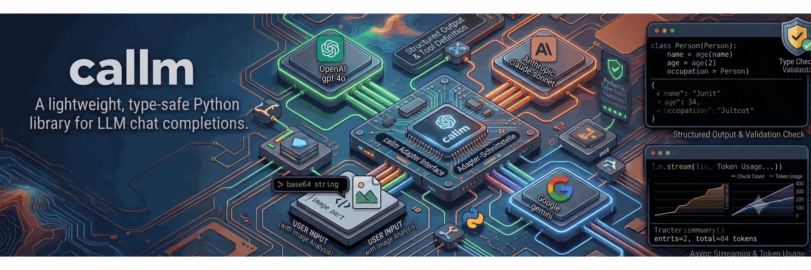

# llmify



A small, type-safe Python interface to the chat models, built on
[pydantic-ai](https://github.com/pydantic/pydantic-ai).

llmify is the contract, not the transport. Seven providers reach you through one
`ChatModel`: awaited for a turn, iterated for a stream, and the same either way.
The wire protocols underneath are pydantic-ai's, which is why there is so little
here to go wrong.

**Features:**

- One interface across OpenAI, Codex and Azure OpenAI
- Type-safe structured output with Pydantic
- Tool calling
- Async streaming, ending in the same response a call returns
- Images, reasoning traces and cache-aware token usage
- Automatic retries for transient failures, with per-retry callbacks

## Contents

- [Installation](#installation)
- [Quick start](#quick-start)
- [The contract](#the-contract)
  - [Messages](#messages)
  - [Calling](#calling)
  - [Streaming](#streaming)
  - [Structured output](#structured-output)
  - [Tools](#tools)
  - [Images](#images)
  - [Usage and reasoning](#usage-and-reasoning)
  - [Errors and retries](#errors-and-retries)
- [Providers](#providers)
- [Model settings](#model-settings)
- [Credits](#credits)
- [License](#license)

## Installation

```bash
pip install py-llmify
```

Install only the provider you need:

```bash
pip install py-llmify[openai]      # OpenAI, Azure OpenAI and Codex
```

Importing `llmify` never imports a provider SDK, so an extra you did not install
costs you nothing.

## Quick start

```python
import asyncio
from llmify import ChatOpenAI, SystemMessage, UserMessage

async def main():
    async with ChatOpenAI("gpt-5.6") as model:
        response = await model([
            SystemMessage(content="You are a helpful assistant."),
            UserMessage(content="What is 2+2?"),
        ])

    print(response.completion)          # "2 + 2 equals 4."
    print(response.usage.total_tokens)  # 29

asyncio.run(main())
```

## The contract

Everything public lives in `llmify.base`, and every provider speaks exactly it.

### Messages

Four message types, all frozen, so a history can be shared between requests
without one of them editing another's:

```python
from llmify import SystemMessage, UserMessage, AssistantMessage, ToolResultMessage

messages = [
    SystemMessage(content="You are a Python expert."),
    UserMessage(content="How do I read a file?"),
    AssistantMessage(content="Use open() with a context manager."),
    UserMessage(content="Show me an example."),
]
```

A `SystemMessage` is carried as the request's instructions rather than as a turn
in the history, which is what every provider actually wants.

### Calling

`call` runs one turn and returns it whole. `await model(...)` is the same thing,
spelled shorter:

```python
response = await model.call(messages)
response = await model(messages)     # identical
```

A `ModelResponse` carries:

| Field | What it is |
| --- | --- |
| `completion` | the text, or the parsed object when `output_format` was given |
| `thinking` | the reasoning trace, when the model exposed one |
| `tool_calls` | what the model wants run before it can finish |
| `usage` | input, output and cache token counts |
| `finish_reason` | why the model stopped |
| `provider_state` | the provider's own turn, for replaying it verbatim |

`response.as_assistant_message()` turns a turn into the history entry for the
next request, `provider_state` included — which is what keeps a reasoning model
from losing its train of thought across a tool round-trip.

### Streaming

A stream yields deltas as they arrive and ends with exactly one `ModelResponse`,
the same value `call` would have returned. Tool calls are never streamed
half-built: each one arrives once its arguments are complete.

```python
from llmify import ModelEventType

async for event in model.stream(messages):
    match event.type:
        case ModelEventType.TEXT_DELTA:
            print(event.delta, end="", flush=True)
        case ModelEventType.THINKING_DELTA:
            ...  # reasoning, kept separate from the answer
        case ModelEventType.TOOL_CALL:
            print(event.tool_call.name)
        case ModelEventType.RESPONSE:
            print(event.usage.total_tokens)
```

### Structured output

Hand `call` a Pydantic model and get one back:

```python
from pydantic import BaseModel

class Recipe(BaseModel):
    name: str
    minutes: int
    ingredients: list[str]

response = await model(messages, output_format=Recipe)
response.completion.ingredients  # list[str]
```

Every provider does this through a tool call, since that is the one shape all of
them speak. An answer that does not parse raises `ModelBehaviorError` rather
than arriving as something it is not.

### Tools

A tool is a name, a description and a JSON schema. Running the calls the model
asks for is up to you:

```python
from llmify import ModelTool, ToolResultMessage

search_web = ModelTool(
    name="search_web",
    description="Search the web for information.",
    parameters={
        "type": "object",
        "properties": {"query": {"type": "string", "description": "What to look for"}},
        "required": ["query"],
    },
)

messages = [UserMessage(content="Look up llmify and summarise it.")]

while True:
    response = await model(messages, tools=[search_web])
    messages.append(response.as_assistant_message())
    if not response.tool_calls:
        break
    for call in response.tool_calls:
        query = call.parsed_arguments["query"]
        messages.append(ToolResultMessage(
            tool_call_id=call.id,
            tool_name=call.name,
            content=f"results for {query}",
        ))
```

`tool_choice` takes `"auto"`, `"required"` or `"none"`.

### Images

```python
from llmify import ImageUrl, UserMessage

UserMessage(content=(
    "What's in this image?",
    ImageUrl(url="https://example.com/photo.jpg", detail="high"),
))
```

A `data:` URI works the same way and is sent as bytes.

### Usage and reasoning

`Usage` reports `input_tokens`, `output_tokens`, `cache_read_tokens`,
`cache_write_tokens` and a `total_tokens` property. Every provider fills the same
fields; a counter a provider does not report stays zero.

### Errors and retries

Provider failures arrive as llmify errors, whichever SDK raised them:

| Error | Raised when |
| --- | --- |
| `AuthenticationError` | credentials rejected (401, 403) |
| `CredentialsUnavailableError` | credentials missing or unusable, a new login is needed |
| `RateLimitError` | 429 — retryable |
| `RetryableError` | 5xx, 408, transport failures |
| `OutOfCreditsError` | quota or billing exhausted |
| `ContextLengthExceededError` | the input did not fit |
| `ModelBehaviorError` | the answer did not fit the shape it was asked for |

Retryable failures are retried with exponential backoff, honouring `Retry-After`
when the provider sends one. A stream is only retried while nothing has been
emitted yet, so output is never replayed.

```python
async def log_retry(event):
    print(f"attempt {event.failed_attempt}/{event.max_attempts} failed, "
          f"waiting {event.delay:.1f}s")

model = ChatOpenAI("gpt-5.6", max_retries=3, on_retry=log_retry)
```

## Providers

Every constructor takes the model name first and falls back to the usual
environment variable for credentials.

```python
from llmify import (
    ChatOpenAI,            # OPENAI_API_KEY
    ChatOpenAIResponses,   # OPENAI_API_KEY — the Responses API
    ChatAzureOpenAI,       # AZURE_OPENAI_API_KEY + AZURE_OPENAI_ENDPOINT
    ChatAzureOpenAIResponses,
    ChatCodex,             # a ChatGPT subscription
    OpenAICompatible,      # anything else speaking OpenAI's API
)

model = ChatOpenAI("gpt-5.6", api_key="sk-...", base_url="https://...")
model = ChatAzureOpenAI("my-deployment", api_version="2024-10-01")
model = OpenAICompatible("llama-3.3-70b", base_url="http://localhost:11434/v1")
```

**Reasoning models.** `ChatOpenAIResponses` (and `ChatCodex`, and
`ChatAzureOpenAIResponses`) take `reasoning_effort` — `"none"`, `"minimal"`,
`"low"`, `"medium"`, `"high"`, `"xhigh"` or `"max"` — and `reasoning_summary`.
Which levels a model accepts differs, and an unsupported one comes back as a
request error. Prefer the Responses API over `ChatOpenAI` for these models: it
carries reasoning state between turns.

**Codex.** A reverse-engineered endpoint that authenticates with a ChatGPT
subscription rather than an API key; OpenAI neither documents nor supports it.
If the [Codex CLI](https://github.com/openai/codex) is logged in, its session
is borrowed:

```python
model = ChatCodex("gpt-5.6-terra", reasoning_effort="high")
```

`ChatCodex` uses HTTP by default. Set `transport="websocket"` to reuse a
WebSocket connection across turns. If opening that connection or starting a
response fails, it retries the request over HTTP. A connection lost after a
response starts is reported without replaying the request.

This reads `~/.codex/auth.json` (honouring `CODEX_HOME`) but never writes it,
so refreshed tokens last only as long as the process. To keep them, pass a
`credential_source` — any `OpenAICodexCredentialSource`, as described in
[pydantic-ai's docs](https://ai.pydantic.dev/models/openai-codex/#persisting-credentials).
A missing or unusable login raises `CredentialsUnavailableError`.

## Model settings

Shared pydantic-ai settings are named, keyword-only parameters on every model
constructor. The IDE can show their types and defaults:

```python
model = ChatOpenAI(
    "gpt-5.6",
    max_tokens=1000,
    temperature=0.7,
    stop_sequences=["\n\n"],
    timeout=60.0,
    max_retries=2,
    extra_headers={"X-Tenant": "acme"},
)
```

The older `stop` and `default_headers` names still work as aliases. A setting's
availability depends on the provider and model. Other provider-specific options
are passed to pydantic-ai as model settings:

```python
model = ChatOpenAIResponses("gpt-5.6", openai_text_verbosity="low")
```

See [pydantic-ai's model settings](https://ai.pydantic.dev/api/settings/) for
the full list.

## Credits

Built on [pydantic-ai](https://github.com/pydantic/pydantic-ai). Inspired by
[LangChain](https://github.com/langchain-ai/langchain) and
[browser-use](https://github.com/browser-use/browser-use).

## License

MIT
